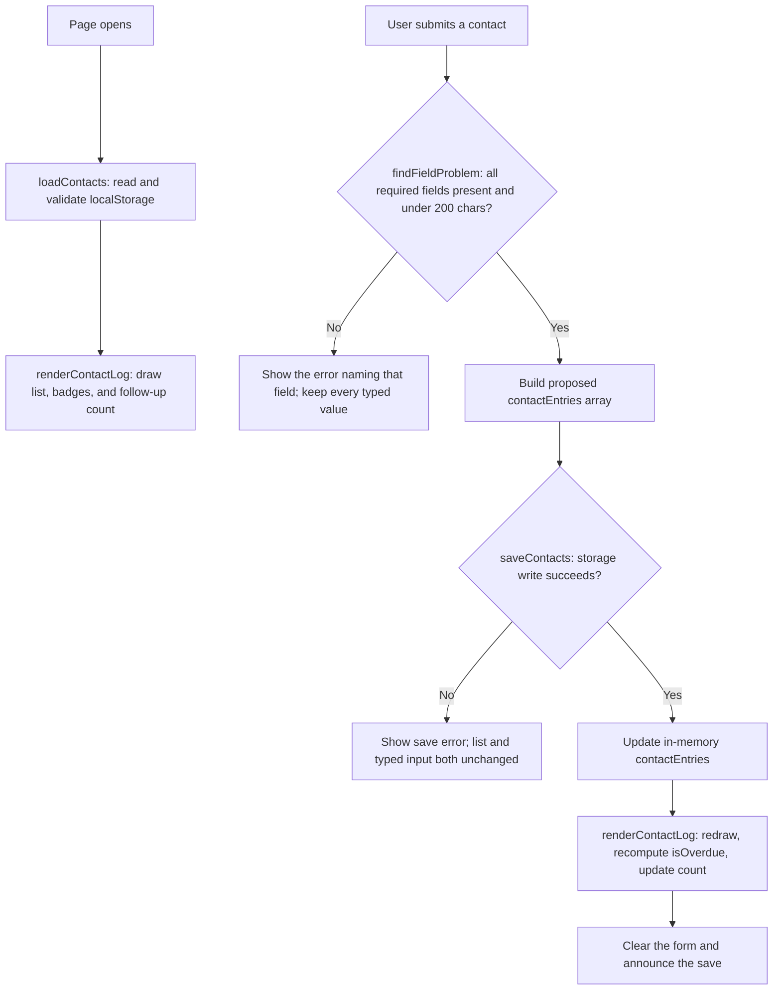

# Coach Contact Log

## What

A high school soccer player records which college coaches she has emailed, at
which school, on what date, and where each one stands, and the log flags any
coach who has been sitting unanswered for seven days or more. The problem it
serves is in [PROJECT.md](context/PROJECT.md): families cannot tell what
recruiting help is worth before they are asked to pay for it. The narrower
problem it actually solves comes from an interview recorded in
[USERS.md](context/USERS.md), where the athlete described telling herself to
follow up and then forgetting which coaches she owed an email, because practice
or school got in the way. That is a memory failure, not a motivation failure, so
the fix is a record rather than a reminder. The full specification, the Kano
classification that selected this feature out of eight candidates, and the
verification run are in [FEATURES.md](context/FEATURES.md).

## See It Work

This demonstrates **E13**: *WHILE an entry's status is "awaiting reply" and 7 or
more days have passed since its contact date, THE SYSTEM SHALL mark that entry as
due for follow-up.* Three entries are saved and only the eight-day-old one is
flagged. The six-day-old entry is deliberately in frame, because a single flagged
row would show the badge working without showing the threshold working. The
follow-up count above the list is the change described under Explain, Change,
Verify.

This demonstrates **E14**: *IF the write to storage fails, THEN THE SYSTEM SHALL
report the failure and leave the athlete's typed input in the form.* The `?failSave`
switch ships with the course starter and forces every write to throw. Three things
are visible at once: the error, the form still holding all three typed values, and
the list unchanged at three entries with no K. Alvarez added. That combination is
the argument in `saveContacts` made visible, and it is why the save is attempted
before anything on screen changes.

A still image cannot establish reload behavior, since persistence is only
meaningful across a page load. E11 is recorded as an observed result in the
[verification table](context/FEATURES.md#verification) instead.

## How to Run

This project runs inside a GitHub Codespace. No local install.

1. On the repository page, click **Code → Codespaces → Create codespace on main**.
   Wait for first-boot setup to finish.
2. Keep the supplied `.devcontainer/devcontainer.json`. It installs Live Server
   and forwards port 5500. Once the extension finishes installing, right-click
   `index.html` and choose **Open with Live Server**, or use **Go Live**.
3. If no browser tab opens, use the **Ports** tab to open port 5500. Keep its
   visibility **Private**.
4. Saving an edit reloads the page. If you change `app.js` and the behavior does
   not change, hard-reload the browser tab to clear the cached script.

Fallback if Live Server is unavailable: run `node scripts/serve.mjs` in the
terminal and open port 5500 from the Ports tab. Refresh manually after edits.
Stop it with **Ctrl+C**. Run only one server on 5500 at a time. Serve over HTTP;
opening `index.html` through `file://` will not persist data correctly.

To see the write-failure path, add `?failSave` to the URL. That switch ships with
the starter and makes every save throw, which is how E14 was tested.

## How It Works

`loadContacts` reads stored data and rejects anything that is not an array of
entries with the four expected string fields. `saveContacts` attempts to persist a
proposed state and reports whether it succeeded. `renderContactLog` draws the
current state, using `textContent` for every user-supplied value, and calls
`isOverdue` on each entry to decide whether to attach a badge. `findFieldProblem`
returns which field failed rather than a generic rejection, because E12 requires
naming the missing field.

The ordering is the load-bearing part. Nothing visible changes until storage has
confirmed the write, which is why a failed save leaves both the list and the
typed input untouched.

## Status

| Area | State | Why |
|------|-------|-----|
| Save and display | Works | E10 and E5 observed in the [verification table](context/FEATURES.md#verification), commit `015a50f` |
| Invalid input | Works | E12 empty-field case observed; the 201-character boundary is recorded CANNOT TEST because it was not re-run in the Codespace |
| Data survives reload | Works | E11 observed: three entries returned in order after a reload, with the overdue flag recomputed on load |
| Storage write failure | Works | E14 observed under `?failSave`: error shown, list unchanged, all typed input preserved. See `docs/contact-log-failsave.png` |
| Follow-up threshold | Works | E13 observed at both 8 days (flagged) and 6 days (not flagged) |
| Multi-user sync | Deferred | localStorage is per-browser and per-device, so the parent cannot see the log at all. Named as a defect, not a rough edge, in [ADR-001](context/ARCHITECTURE.md) |

Verification results (click to expand)

The full record, including steps and expected results written before the run,
lives in [FEATURES.md](context/FEATURES.md#verification). Summary:

| Criterion | Status |
|---|---|
| E10 — normal action, save and display | PASS |
| E12 — empty required field named in the error | PASS |
| E12 — 201-character boundary | CANNOT TEST (not re-run in the Codespace; next step recorded) |
| E11 — entries survive a reload | PASS |
| E14 — write failure preserves list and typed input | PASS |
| E13 — flagged at 8 days | PASS |
| E13 — not flagged at 6 days | PASS |
| E5 — coach, date, and status visible without interaction | PASS |

Seven PASS, one CANNOT TEST. The nine service-level statements carried from HW2
(E1 through E9, excluding E5) are classified as outside HW3 implementation scope
in FEATURES.md, each with the reason its evidence is unavailable. They are scope
decisions, not deferrals of required HW3 functionality.

## Links

Read in this order:

0. [`SCAFFOLD_MANIFEST.md`](SCAFFOLD_MANIFEST.md): what carries over from HW2, and the submission checklist
1. [`context/PROJECT.md`](context/PROJECT.md): the problem and its framing
2. [`context/USERS.md`](context/USERS.md): who this is for
3. [`context/FEATURES.md`](context/FEATURES.md): what it must do, and verification results
4. [`context/ARCHITECTURE.md`](context/ARCHITECTURE.md): hard constraints, the weighted gate, the sensitivity check, and ADR-001
5. [`context/STANDARDS.md`](context/STANDARDS.md): the rules this code follows, the split test, and the colleague test
6. [`context/CLAUDE.md`](context/CLAUDE.md): the same rules, written as agent instructions

Five previews remain previews until their modules activate:
[STYLE.md](context/STYLE.md), [TOOLS.md](context/TOOLS.md),
[SKILLS.md](context/SKILLS.md), [EVALS.md](context/EVALS.md), and
[AGENTS.md](context/AGENTS.md). Verification stays in FEATURES.md until EVALS.md
activates in Module 5.

The two instruction adapters are root [CLAUDE.md](CLAUDE.md), which imports
`@context/CLAUDE.md`, and
[.github/copilot-instructions.md](.github/copilot-instructions.md).

## AI Use

**Tool and task delegated:** Claude (Opus 5, via Claude Code) drafted the six
active context documents, adapted the starter's single-string note model into the
four-field contact entry model in `app.js`, `index.html`, and `styles.css`, and
wrote the steps and expected results in the verification table before the run.

**Why:** The documents are restatements of research and decisions I had already
made in HW1 and HW2, so drafting them is transcription rather than thinking, and
delegating it bought time for the parts that are not. The code adaptation was
structural: the starter's load, save, render pattern already worked, and the task
was to change what a record contains rather than how records are handled.

**How it was checked:** I read `saveContacts` line by line until I could explain
the ordering without looking at it, and that explanation is below. I ran every
row of the verification table myself in the Codespace and recorded what I saw. I
caught two formatting defects in the delegated edits, where two statements were
placed on a single line in `index.html` and `app.js`, and an indentation block in
`app.js` that sat at the wrong level; I fixed all three. I also rejected one
proposed verification result: the 201-character boundary had been exercised on a
local server rather than in the Codespace, so it is recorded as CANNOT TEST
rather than PASS.

**Observed result / evidence:** Seven of eight checks passed with observed
results recorded in
[FEATURES.md](context/FEATURES.md#verification), all against commit `015a50f`.
The one CANNOT TEST row states the limitation and the next step.

**Instruction discovery and compliance:** GitHub Copilot was **not run**. The
`.github/copilot-instructions.md` adapter is present and unmodified, but no
Copilot session was started in this repository, so I have no discovery evidence
to report and will not claim any. Claude Code was run from the repository root on
a local clone, where root `CLAUDE.md` imports `@context/CLAUDE.md`; however, that
file was authored during this assignment rather than discovered mid-task by a
tool that had not seen it, so I am not presenting it as a discovery test either.
In place of tool evidence I ran a manual standards review against
[STANDARDS.md](context/STANDARDS.md): the three files keep HTML, CSS, and
JavaScript separate with no inline styles and no script in the HTML beyond the
loader tag (rule 2); every user-supplied value reaches the page through
`textContent` and `innerHTML` appears nowhere in `app.js` (rule 5); no
frameworks, CDN tags, or package installs were added (rule 7); every control has
an associated label and both the error and status regions are announceable (rule
6); and the commits name changed behavior rather than changed files (rule 4). The
one rule I could not self-assess fairly is rule 3 on comments, since I did not
write most of them.

**Actual hours on this assignment (optional):** [REPLACE WITH A NUMBER]

## Explain, Change, Verify

**The function.** This code is basically trying to save the contact information to
the browser's local storage. If it saves correctly, it returns true and keeps
going. If something goes wrong, it shows a message saying the entry could not be
saved but is still there. It then returns false so the program knows the save
didn't work. The order matters: if the form cleared and the list updated before
the save, you would be looking at the new entry on the screen like it saved, but
it actually didn't save to storage. The form would also already be cleared, so
the information you typed could be lost. It would look like everything worked
even though the save failed.

**The change.** I added a count of how many contacts are due for follow-up, shown
above the list ([commit `015a50f`](../../commit/015a50f)). Before the change the
page flagged individual overdue rows but never said how many there were, so
answering "how far behind am I" meant scanning every entry. The new code filters
the saved entries through the existing `isOverdue` check and writes a sentence
into a slot in the HTML. I wrote it as three branches rather than one compressed
line because `CLAUDE.md` tells an agent working here to prefer the obvious
construction over the clever one, and that rule should apply to me too.

**Expected effect:** with one entry past seven days awaiting a reply, a line
reading "1 contact due for follow-up." appears above the list; with two, it reads
"2 contacts due for follow-up."; with none, nothing is shown.

**Observed result:** after saving an eight-day-old entry the line appeared
reading "1 contact due for follow-up." Saving a six-day-old entry afterward left
the count at one, confirming it counts the same entries the badge flags rather
than counting rows. The count also re-rendered correctly after a page reload,
which means it is computed from stored data on load rather than only at save
time. Evidence is in the E13 rows of the [verification
table](context/FEATURES.md#verification) and in the screenshot above.

**Why it matters to the requirement.** E13 tells the athlete which coaches are
overdue. It does not tell her how many, and the interview in USERS.md says the
thing she actually loses track of is the backlog, not any single coach. The count
turns a row-level flag into an answer to the question she is really asking.
